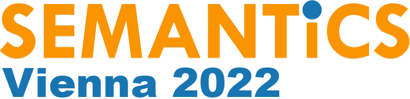
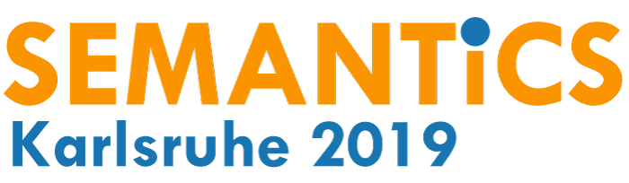

# Previous Proceedings

    
    
SEMANTiCS 2024

    

    20th International Conference on Semantic Systems
    

  - ​Proceedings of the Research and Innovation Track - [Knowledge Graphs in the Age of Language Models and Neuro-Symbolic AI](https://ebooks.iospress.nl/volume/knowledge-graphs-in-the-age-of-language-models-and-neuro-symbolic-ai-proceedings-of-the-20th-international-conference-on-semantic-systems) (Studies on the Semantic Web, IOS Press)
  - Posters, demos and some workshop proceedings - [Posters, Demos, Workshops, and Tutorials of the 20th International Conference on Semantic Systems (SEMANTiCS 2024)](https://ceur-ws.org/Vol-3759/) (CEUR WS)

  <a href="https://2024-eu.semantics.cc/">website</a>

    
    
SEMANTiCS 2023

    

    19th International Conference on Semantic Systems
    

  - ​Proceedings of the Research and Innovation Track - [Knowledge Graphs: Semantics, Machine Learning, and Languages](https://ebooks.iospress.nl/ISBN/978-1-64368-425-3) (Studies on the Semantic Web, IOS Press)
  - Proceedings of the Posters and Demo Track [Posters and Demos at SEMANTiCS 2023](https://ceur-ws.org/Vol-3526/) (CEUR WS)

  <a href="https://2023-eu.semantics.cc/">website</a>

    
    
SEMANTiCS 2022

    

    18th International Conference on Semantic Systems
    

  - ​Proceedings of the Research and Innovation Track - [Towards a Knowledge-Aware AI](https://ebooks.iospress.nl/volume/towards-a-knowledge-aware-ai-semantics-2022-proceedings-of-the-18th-international-conference-on-semantic-systems-1315-september-2022-vienna-austria)  (Studies on the Semantic Web, IOS Press)
  - Proceedings of the Poster, Demos, and some Workshops - [Posters, Demos and Workshops at SEMANTiCS 2022](http://ceur-ws.org/Vol-3235/) (CEUR WS)

  <a href="https://2022-eu.semantics.cc/">website</a>

    
    
SEMANTiCS 2021

    

    17th International Conference on Semantic Systems
    

  - ​Proceedings of the Research and Innovation Track - [Further with Knowledge Graphs](https://ebooks.iospress.nl/ISBN/978-1-64368-201-3)  (Studies on the Semantic Web, IOS Press)	
  - Proceedings of the Poster and Demos - [Semantics Compound Volume 2021](http://ceur-ws.org/Vol-2941/) (CEUR WS)

  <a href="https://2021-eu.semantics.cc/">website</a>

    
    
SEMANTiCS 2020

    

    16th International Conference on Semantic Systems
    

  - Proceedings of the Research and Innovation Track - [Semantic Systems. In the Era of Knowledge Graphs](https://link.springer.com/book/10.1007/978-3-030-59833-4)  (Lecture Note in Computer Science, Springer Nature)

  <a href="https://2020-eu.semantics.cc/">website</a>

    
    
SEMANTiCS 2019

    

    15th International Conference on Semantic Systems
    

  - Proceedings of the Research and Innovation Track - [Semantic Systems. The Power of AI and Knowledge Graphs](https://link.springer.com/book/10.1007/978-3-030-33220-4) (Lecture Note in Computer Science, Springer Nature)	
  - Proceedings of the Poster and Demos - [Posters&Demos at SEMANTiCS 2019](http://ceur-ws.org/Vol-2451/) (CEUR WS)
  <a href="">website</a>

    
    
SEMANTiCS 2018

    

    14th International Conference on Semantic Systems
    

  - Proceedings of the Research and Innovation Track - [Proceedings of the 14th International Conference on Semantic Systems](https://link.springer.com/book/10.1007/978-3-030-33220-4) (Procedia Computer Science, Elsevier)	
  - Proceedings of the Poster and Demos - [Posters&Demos at SEMANTiCS 2018](http://ceur-ws.org/Vol-2198/) (CEUR WS)

  <a href="">website</a>

    
    
SEMANTiCS 2017

    

    13th International Conference on Semantic Systems
    

  - Proceedings of the Research and Innovation Track - [Semantics2017: Proceedings of the 13th International Conference on Semantic Systems](https://dl.acm.org/doi/proceedings/10.1145/3132218) (ACM)	
  - Proceedings of the Poster and Demos - [Posters&Demos@SEMANTiCS 2017](http://ceur-ws.org/Vol-2044) (CEUR WS)
  - Proceedings of the Workshop papers - [Workshops of SEMANTiCS 2017](http://ceur-ws.org/Vol-2063) (CEUR WS)

  <a href="">website</a>

    
SEMANTiCS 2016

    <!--  -->
    

    12th International Conference on Semantic Systems
    

  - Proceedings of the Research and Innovation Track - [SEMANTiCS 2016: Proceedings of the 12th International Conference on Semantic Systems](https://dl.acm.org/doi/proceedings/10.1145/2993318) (ACM)	
  - Proceedings of the Poster and Demos - [Posters&Demos@SEMANTiCS 2016 and SuCCESS'16 Workshop](http://ceur-ws.org/Vol-1695/) (CEUR WS) 
  <a href="">website</a>

    
SEMANTiCS 2015

    <!--  -->
    

    11th International Conference on Semantic Systems
    

  - Proceedings of the Research and Innovation Track - [EMANTICS '15: Proceedings of the 11th International Conference on Semantic Systems](https://dl.acm.org/doi/proceedings/10.1145/2814864) (ACM)	
  - Proceedings of the Poster and Demos - [Posters&Demos@SEMANTiCS 2015 and DSci15 Workshop](http://ceur-ws.org/Vol-1481/) (CEUR WS)
  <a href="">website</a>

    
SEMANTiCS 2014

    <!--  -->
    

    10th International Conference on Semantic Systems
    

  - Proceedings of the Research and Innovation Track - [SEM '14: Proceedings of the 10th International Conference on Semantic Systems](https://dl.acm.org/doi/proceedings/10.1145/2660517) (ACM)	
  - Proceedings of the Poster and Demos - [Posters&Demos@SEMANTiCS 2014](http://ceur-ws.org/Vol-1224/) (CEUR WS)

  <a href="">website</a>

    
I-SEMANTiCS 2013

    <!--  -->
    

    9th International Conference on Semantic Systems
    

  - Proceedings of the Research and Innovation Track - [I-SEMANTICS '13: Proceedings of the 9th International Conference on Semantic Systems](https://dl.acm.org/doi/proceedings/10.1145/2506182) (ACM)	
  - Proceedings of the Poster and Demos - [I-SEMANTICS 2013 Posters & Demos](http://ceur-ws.org/Vol-1026/) (CEUR WS)

  <a href="">website</a>

    
I-SEMANTiCS 2012

    <!--  -->
    

    8th International Conference on Semantic Systems
    

  - Proceedings of the Research and Innovation Track - [I-SEMANTICS '12: Proceedings of the 8th International Conference on Semantic Systems](https://dl.acm.org/doi/proceedings/10.1145/2362499) (ACM)	
  - Proceedings of the Poster and Demos - [I-SEMANTICS 2012 Posters & Demos](http://ceur-ws.org/Vol-1026/) (CEUR WS)

  <a href="">website</a>

    
I-SEMANTiCS 2011

    <!--  -->
    

    7th International Conference on Semantic Systems
    

  - Proceedings of the Research and Innovation Track - [I-Semantics '11: Proceedings of the 7th International Conference on Semantic Systems](https://dl.acm.org/doi/proceedings/10.1145/2063518) (ACM)	

  <a href="">website</a>

    
I-SEMANTiCS 2010

    <!--  -->
    

    6th International Conference on Semantic Systems
    

  - Proceedings of the Research and Innovation Track - [I-SEMANTICS '10: Proceedings of the 6th International Conference on Semantic Systems](https://dl.acm.org/doi/proceedings/10.1145/1839707) (ACM)	

  <a href="">website</a>

    
I-SEMANTiCS 2009

    <!--  -->
    

    5th International Conference on Semantic Systems
    

  - Proceedings of the Research and Innovation Track - [Proceedings of I-SEMANTICS '09: 5th international conference on semantic systems](https://hdl.handle.net/10419/44444) (Journal of universal computer science / J.UCS conference proceedings series)

  <a href="">website</a>

A comprehensive list of proceedings and research papers is available on [DBLP](https://dblp.org/db/conf/i-semantics/index.html).