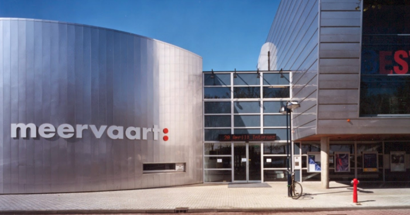
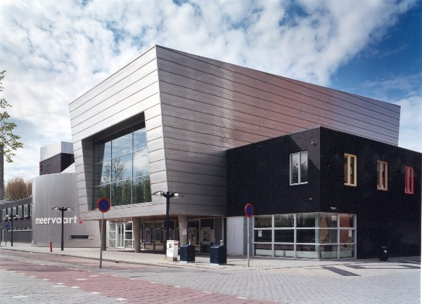

# Venue

 
   
   

 

***SEMANTiCS 2024 is hosted by the Vrije Universiteit Amsterdam. The SEMANTiCS conference will take place at the Meervaart Theatre in Amsterdam.***

Meervaart, Meer en Vaart 300, 1068 LE Amsterdam, Netherlands

The Meervaart is one of the best known venues in the Netherlands and offers facilities for groups from 12 to 800 people. The Meervaart is a conference centre and theatre that hosts over 100 conferences per year. It is uniquely located on the banks of a city lake, the Sloterplas. Almost exactly in the middle between Schiphol airport and the Amsterdam city centre, the venue is easily accessible to visitors from near and far. Multiple public transport options are available on the doorstep, as well as ample, low-cost parking. The National Congress and Meeting Classification classifies the Meervaart as a venue with a luxury business atmosphere, that measures up to the strictest technical requirements for meetings and conferences.  

 Recommended Hotels

<table>
  <tr>
    <th>Hotel</th>
    <th>Address</th>
    <!--<th>Get a reduced rate until</th>-->
  </tr>

  <tr>
    <td><a href="https://www.bastionhotels.com/en-gb/hotels/hotel-amsterdam-zuidwest?gad_source=1&gclid=Cj0KCQjw4MSzBhC8ARIsAPFOuyU6bbN81Cucr1iVzsTs2y_3nEIlsZcRUDYCAEmFu5QyJMgaYIiZu8MaAg-QEALw_wcB&gclsrc=aw.ds">Bastion Hotel Amsterdam Zuidwest</a></td>
    <td>Hendrikje Stoffelstraat 60 1058 GC Amsterdam  +31 (0)20 669 1621 </td>
    <!--<td>10.09.2023 Please write an email to <a href="mailto:semantics@infai.org ">semantics@infai.org</a></td>-->
  </tr>

  <tr>
    <td><a href="https://methotelamsterdam.com/">Met Hotel Amsterdam</a></td>
    <td>Marius Bauerstraat 401 1062 AP Amsterdam  +31 (0)20 218 4244 <a href="mailto:reservations@methotelamsterdam.com">reservations@methotelamsterdam.com</a></td>
    <!--<td>10.09.2023 Please write an email to <a href="mailto:semantics@infai.org ">semantics@infai.org</a></td>-->
  </tr>

  <tr>
    <td><a href="https://www.citiezhotelamsterdam.com/">Citiez Hotel Amsterdam</a></td>
    <td>Osdorpplein 372-A 1068 EV Amsterdam  +31 (0)20 224 6280 <a href="mailto:welcome@citiezhotelamsterdam.com">welcome@citiezhotelamsterdam.com</a></td>
    <!--<td>10.09.2023 Please write an email to <a href="mailto:semantics@infai.org ">semantics@infai.org</a></td>-->
  </tr>

  <tr>
    <td><a href="https://conscioushotels.com/stay/amsterdam-city">Conscious Hotel Amsterdam City (The Tire Station)</a></td>
    <td>Amstelveenseweg 5 1054 MB Amsterdam  +31 (0)20 820 3333 </td>
    <!--<td>10.09.2023 Please write an email to <a href="mailto:semantics@infai.org ">semantics@infai.org</a></td>-->
  </tr>

  <tr>
    <td><a href="https://conscioushotels.com/stay/vondelpark">Conscious Hotel Vondelpark</a></td>
    <td>Overtoom 519 1054 LH Amsterdam </td>
    <!--<td>10.09.2023 Please write an email to <a href="mailto:semantics@infai.org ">semantics@infai.org</a></td>-->
  </tr>

  <tr>
    <td><a href="https://www.dutchdesignhotelvondelpark.com/">Dutch Design Hotel Vondelpark</a></td>
    <td>Waldeck Pyrmontlaan 9 1075 BT Amsterdam  +31 (0)20 714 2010 <a href="mailto:info@dutchdesignhotelvondelpark.com">info@dutchdesignhotelvondelpark.com</a></td>
    <!--<td>10.09.2023 Please write an email to <a href="mailto:semantics@infai.org ">semantics@infai.org</a></td>-->
  </tr>

  <tr>
    <td><a href="https://www.mercure-hotel-amsterdam-west.nl/en/">Mercure Hotel Amsterdam West</a></td>
    <td>Oude Haagseweg 20 1066 BW Amsterdam  +31 (0)20 512 6767 <a href="mailto:frontoffice@mercureamsterdam.com">frontoffice@mercureamsterdam.com</a></td>
    <!--<td>10.09.2023 Please write an email to <a href="mailto:semantics@infai.org ">semantics@infai.org</a></td>-->
  </tr>

  <tr>
    <td><a href="https://www.artemisamsterdam.com/">Dutch Design Hotel Artemis</a></td>
    <td>John M. Keynesplein 2 1066 EP Amsterdam  +31 (0)20 714 1000 <a href="mailto:reservations@artemisamsterdam.com">reservations@artemisamsterdam.com</a></td>
    <!--<td>10.09.2023 Please write an email to <a href="mailto:semantics@infai.org ">semantics@infai.org</a></td>-->
  </tr>
</table>
 

We have secured contingents in a few hotels in Amsterdam. After you have purchased your Semantics ticket, you will automatically receive an email from the registration system ConfTool containing this list.

### Travel

 Fly in by plane
 

From Schiphol airport it takes about 15-25 minutes to reach the venue by public transport or even faster by taking a taxi. By public transport you can easily plan the route via [here](https://www.google.com/maps/dir/Avis+Budget+Autoverhuur+Amsterdam+Schiphol,+Aankomstpassage+5,+1118+AX+Schiphol,+Netherlands/Meervaart,+Meer+en+Vaart+300,+1068+LE+Amsterdam,+Netherlands/@52.3338805,4.7489029,13z/data=!4m13!4m12!1m5!1m1!1s0x47c5e129cd42a477:0xa9dfb4f481a89983!2m2!1d4.76146!2d52.30967!1m5!1m1!1s0x47c5e3d2049c0b57:0x1c80bfab51a1315f!2m2!1d4.8073711!2d52.3590932?entry=ttu).

## Parking spaces in Amsterdam
Check all [car parks](https://www.meervaart.nl/theater/english/uw-bezoek/bereikbaarheid-en-parkeren) in Amsterdam.